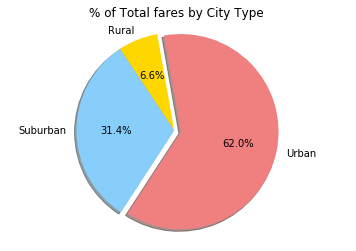
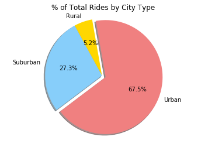
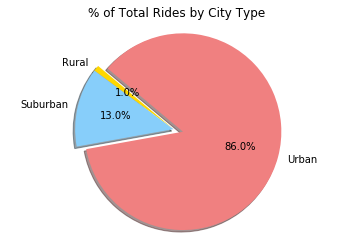

```python
#import
import pandas as pd
import numpy as np
import matplotlib.pyplot as plt
```


```python
#read csv
file_load1 = "raw_data/city_data.csv"
file_load2 = "raw_data/ride_data.csv"
```


```python
#city dataframe
city_df = pd.read_csv(file_load1)

#ride df
ride_df = pd.read_csv(file_load2)


```


```python
#merge dataframe
#Result_merge = ride_df.merge(city_df, on= 'city', how= 'outer')
#Result_merge.sort_values(by= 'city')

Result_merge1 = pd.merge(ride_df,city_df, on ='city', how='outer')
Result_merge1.sort_values(by= 'city', ascending= True)

```


<div>
<style scoped>
    .dataframe tbody tr th:only-of-type {
        vertical-align: middle;
    }

    .dataframe tbody tr th {
        vertical-align: top;
    }

    .dataframe thead th {
        text-align: right;
    }
</style>
<table border="1" class="dataframe">
  <thead>
    <tr style="text-align: right;">
      <th></th>
      <th>city</th>
      <th>date</th>
      <th>fare</th>
      <th>ride_id</th>
      <th>driver_count</th>
      <th>type</th>
    </tr>
  </thead>
  <tbody>
    <tr>
      <th>1489</th>
      <td>Alvarezhaven</td>
      <td>2016-07-04 04:28:22</td>
      <td>33.31</td>
      <td>306054352684</td>
      <td>21</td>
      <td>Urban</td>
    </tr>
    <tr>
      <th>1475</th>
      <td>Alvarezhaven</td>
      <td>2016-06-11 23:45:52</td>
      <td>43.34</td>
      <td>3938173695105</td>
      <td>21</td>
      <td>Urban</td>
    </tr>
    <tr>
      <th>1476</th>
      <td>Alvarezhaven</td>
      <td>2016-02-07 02:46:18</td>
      <td>35.22</td>
      <td>5405756761666</td>
      <td>21</td>
      <td>Urban</td>
    </tr>
    <tr>
      <th>1477</th>
      <td>Alvarezhaven</td>
      <td>2016-01-21 07:25:48</td>
      <td>22.83</td>
      <td>3565582370530</td>
      <td>21</td>
      <td>Urban</td>
    </tr>
    <tr>
      <th>1479</th>
      <td>Alvarezhaven</td>
      <td>2016-05-20 12:26:56</td>
      <td>42.00</td>
      <td>7852567608457</td>
      <td>21</td>
      <td>Urban</td>
    </tr>
    <tr>
      <th>1480</th>
      <td>Alvarezhaven</td>
      <td>2016-08-03 06:45:57</td>
      <td>4.07</td>
      <td>6100187302721</td>
      <td>21</td>
      <td>Urban</td>
    </tr>
    <tr>
      <th>1481</th>
      <td>Alvarezhaven</td>
      <td>2016-01-25 06:02:25</td>
      <td>5.16</td>
      <td>2233026076010</td>
      <td>21</td>
      <td>Urban</td>
    </tr>
    <tr>
      <th>1482</th>
      <td>Alvarezhaven</td>
      <td>2016-11-19 02:00:34</td>
      <td>5.34</td>
      <td>1108172306544</td>
      <td>21</td>
      <td>Urban</td>
    </tr>
    <tr>
      <th>1483</th>
      <td>Alvarezhaven</td>
      <td>2016-02-15 11:14:12</td>
      <td>31.74</td>
      <td>5487020911007</td>
      <td>21</td>
      <td>Urban</td>
    </tr>
    <tr>
      <th>1484</th>
      <td>Alvarezhaven</td>
      <td>2016-06-16 18:29:05</td>
      <td>32.46</td>
      <td>858631473935</td>
      <td>21</td>
      <td>Urban</td>
    </tr>
    <tr>
      <th>1485</th>
      <td>Alvarezhaven</td>
      <td>2016-03-16 02:01:15</td>
      <td>33.62</td>
      <td>8974645194719</td>
      <td>21</td>
      <td>Urban</td>
    </tr>
    <tr>
      <th>1486</th>
      <td>Alvarezhaven</td>
      <td>2016-09-19 16:01:49</td>
      <td>27.51</td>
      <td>6282665852239</td>
      <td>21</td>
      <td>Urban</td>
    </tr>
    <tr>
      <th>1487</th>
      <td>Alvarezhaven</td>
      <td>2016-05-16 15:33:14</td>
      <td>6.45</td>
      <td>8939751998750</td>
      <td>21</td>
      <td>Urban</td>
    </tr>
    <tr>
      <th>1488</th>
      <td>Alvarezhaven</td>
      <td>2016-01-27 10:38:40</td>
      <td>6.72</td>
      <td>6152998520191</td>
      <td>21</td>
      <td>Urban</td>
    </tr>
    <tr>
      <th>1459</th>
      <td>Alvarezhaven</td>
      <td>2016-04-18 20:51:29</td>
      <td>31.93</td>
      <td>4267015736324</td>
      <td>21</td>
      <td>Urban</td>
    </tr>
    <tr>
      <th>1460</th>
      <td>Alvarezhaven</td>
      <td>2016-08-01 00:39:48</td>
      <td>6.42</td>
      <td>8394540350728</td>
      <td>21</td>
      <td>Urban</td>
    </tr>
    <tr>
      <th>1474</th>
      <td>Alvarezhaven</td>
      <td>2016-05-15 20:43:44</td>
      <td>40.04</td>
      <td>1806812593131</td>
      <td>21</td>
      <td>Urban</td>
    </tr>
    <tr>
      <th>1473</th>
      <td>Alvarezhaven</td>
      <td>2016-09-23 21:51:59</td>
      <td>17.67</td>
      <td>3829336915201</td>
      <td>21</td>
      <td>Urban</td>
    </tr>
    <tr>
      <th>1478</th>
      <td>Alvarezhaven</td>
      <td>2016-05-01 14:35:12</td>
      <td>22.54</td>
      <td>6435260355302</td>
      <td>21</td>
      <td>Urban</td>
    </tr>
    <tr>
      <th>1462</th>
      <td>Alvarezhaven</td>
      <td>2016-08-18 07:12:06</td>
      <td>20.74</td>
      <td>357421158941</td>
      <td>21</td>
      <td>Urban</td>
    </tr>
    <tr>
      <th>1466</th>
      <td>Alvarezhaven</td>
      <td>2016-01-28 23:53:55</td>
      <td>9.87</td>
      <td>2747592323442</td>
      <td>21</td>
      <td>Urban</td>
    </tr>
    <tr>
      <th>1467</th>
      <td>Alvarezhaven</td>
      <td>2016-04-25 08:50:08</td>
      <td>31.82</td>
      <td>7948246793429</td>
      <td>21</td>
      <td>Urban</td>
    </tr>
    <tr>
      <th>1468</th>
      <td>Alvarezhaven</td>
      <td>2016-09-16 14:36:24</td>
      <td>20.61</td>
      <td>8307812366044</td>
      <td>21</td>
      <td>Urban</td>
    </tr>
    <tr>
      <th>1469</th>
      <td>Alvarezhaven</td>
      <td>2016-03-16 22:24:17</td>
      <td>31.08</td>
      <td>7413831046469</td>
      <td>21</td>
      <td>Urban</td>
    </tr>
    <tr>
      <th>1470</th>
      <td>Alvarezhaven</td>
      <td>2016-01-20 06:52:53</td>
      <td>42.41</td>
      <td>7825539032352</td>
      <td>21</td>
      <td>Urban</td>
    </tr>
    <tr>
      <th>1463</th>
      <td>Alvarezhaven</td>
      <td>2016-04-04 23:45:50</td>
      <td>14.25</td>
      <td>6431434271355</td>
      <td>21</td>
      <td>Urban</td>
    </tr>
    <tr>
      <th>1471</th>
      <td>Alvarezhaven</td>
      <td>2016-06-25 22:46:06</td>
      <td>24.16</td>
      <td>9047320468692</td>
      <td>21</td>
      <td>Urban</td>
    </tr>
    <tr>
      <th>1472</th>
      <td>Alvarezhaven</td>
      <td>2016-06-21 09:57:52</td>
      <td>20.88</td>
      <td>9456788060940</td>
      <td>21</td>
      <td>Urban</td>
    </tr>
    <tr>
      <th>1465</th>
      <td>Alvarezhaven</td>
      <td>2016-05-26 11:36:48</td>
      <td>39.28</td>
      <td>8878745717970</td>
      <td>21</td>
      <td>Urban</td>
    </tr>
    <tr>
      <th>1464</th>
      <td>Alvarezhaven</td>
      <td>2016-10-31 05:33:55</td>
      <td>20.23</td>
      <td>4348900295000</td>
      <td>21</td>
      <td>Urban</td>
    </tr>
    <tr>
      <th>...</th>
      <td>...</td>
      <td>...</td>
      <td>...</td>
      <td>...</td>
      <td>...</td>
      <td>...</td>
    </tr>
    <tr>
      <th>1491</th>
      <td>Yolandafurt</td>
      <td>2016-06-01 01:49:06</td>
      <td>31.05</td>
      <td>308132266739</td>
      <td>7</td>
      <td>Urban</td>
    </tr>
    <tr>
      <th>1492</th>
      <td>Yolandafurt</td>
      <td>2016-02-28 11:02:09</td>
      <td>36.00</td>
      <td>6313980463869</td>
      <td>7</td>
      <td>Urban</td>
    </tr>
    <tr>
      <th>1493</th>
      <td>Yolandafurt</td>
      <td>2016-11-20 11:01:23</td>
      <td>24.95</td>
      <td>3736563482430</td>
      <td>7</td>
      <td>Urban</td>
    </tr>
    <tr>
      <th>1494</th>
      <td>Yolandafurt</td>
      <td>2016-10-15 09:08:27</td>
      <td>32.99</td>
      <td>7248809199355</td>
      <td>7</td>
      <td>Urban</td>
    </tr>
    <tr>
      <th>1495</th>
      <td>Yolandafurt</td>
      <td>2016-09-24 14:53:44</td>
      <td>21.25</td>
      <td>7996695327849</td>
      <td>7</td>
      <td>Urban</td>
    </tr>
    <tr>
      <th>1504</th>
      <td>Yolandafurt</td>
      <td>2016-08-27 23:18:36</td>
      <td>34.95</td>
      <td>9030131895269</td>
      <td>7</td>
      <td>Urban</td>
    </tr>
    <tr>
      <th>947</th>
      <td>Zimmermanmouth</td>
      <td>2016-06-29 21:29:33</td>
      <td>17.12</td>
      <td>1214603530980</td>
      <td>45</td>
      <td>Urban</td>
    </tr>
    <tr>
      <th>969</th>
      <td>Zimmermanmouth</td>
      <td>2016-08-21 05:53:52</td>
      <td>40.95</td>
      <td>5672693632216</td>
      <td>45</td>
      <td>Urban</td>
    </tr>
    <tr>
      <th>968</th>
      <td>Zimmermanmouth</td>
      <td>2016-11-12 22:15:06</td>
      <td>5.27</td>
      <td>885932877834</td>
      <td>45</td>
      <td>Urban</td>
    </tr>
    <tr>
      <th>948</th>
      <td>Zimmermanmouth</td>
      <td>2016-08-11 11:17:38</td>
      <td>5.97</td>
      <td>7276044030126</td>
      <td>45</td>
      <td>Urban</td>
    </tr>
    <tr>
      <th>949</th>
      <td>Zimmermanmouth</td>
      <td>2016-08-01 20:38:52</td>
      <td>34.95</td>
      <td>2258161061820</td>
      <td>45</td>
      <td>Urban</td>
    </tr>
    <tr>
      <th>950</th>
      <td>Zimmermanmouth</td>
      <td>2016-09-19 02:40:07</td>
      <td>16.21</td>
      <td>4966546004949</td>
      <td>45</td>
      <td>Urban</td>
    </tr>
    <tr>
      <th>951</th>
      <td>Zimmermanmouth</td>
      <td>2016-07-23 19:20:11</td>
      <td>28.89</td>
      <td>1529363655249</td>
      <td>45</td>
      <td>Urban</td>
    </tr>
    <tr>
      <th>952</th>
      <td>Zimmermanmouth</td>
      <td>2016-05-04 18:32:14</td>
      <td>20.96</td>
      <td>6490497681785</td>
      <td>45</td>
      <td>Urban</td>
    </tr>
    <tr>
      <th>953</th>
      <td>Zimmermanmouth</td>
      <td>2016-02-11 19:07:24</td>
      <td>14.50</td>
      <td>7547394650211</td>
      <td>45</td>
      <td>Urban</td>
    </tr>
    <tr>
      <th>954</th>
      <td>Zimmermanmouth</td>
      <td>2016-05-25 14:46:47</td>
      <td>41.96</td>
      <td>5202604424953</td>
      <td>45</td>
      <td>Urban</td>
    </tr>
    <tr>
      <th>955</th>
      <td>Zimmermanmouth</td>
      <td>2016-08-09 04:35:39</td>
      <td>26.63</td>
      <td>2326214075695</td>
      <td>45</td>
      <td>Urban</td>
    </tr>
    <tr>
      <th>956</th>
      <td>Zimmermanmouth</td>
      <td>2016-08-12 02:53:03</td>
      <td>34.84</td>
      <td>7176327056501</td>
      <td>45</td>
      <td>Urban</td>
    </tr>
    <tr>
      <th>957</th>
      <td>Zimmermanmouth</td>
      <td>2016-05-11 17:45:05</td>
      <td>37.04</td>
      <td>9089069809060</td>
      <td>45</td>
      <td>Urban</td>
    </tr>
    <tr>
      <th>958</th>
      <td>Zimmermanmouth</td>
      <td>2016-01-28 01:13:34</td>
      <td>43.51</td>
      <td>2489772698062</td>
      <td>45</td>
      <td>Urban</td>
    </tr>
    <tr>
      <th>959</th>
      <td>Zimmermanmouth</td>
      <td>2016-11-28 22:05:03</td>
      <td>41.58</td>
      <td>7488861145000</td>
      <td>45</td>
      <td>Urban</td>
    </tr>
    <tr>
      <th>960</th>
      <td>Zimmermanmouth</td>
      <td>2016-04-22 07:47:47</td>
      <td>26.23</td>
      <td>6060050374869</td>
      <td>45</td>
      <td>Urban</td>
    </tr>
    <tr>
      <th>962</th>
      <td>Zimmermanmouth</td>
      <td>2016-08-31 18:06:40</td>
      <td>24.23</td>
      <td>3364398658418</td>
      <td>45</td>
      <td>Urban</td>
    </tr>
    <tr>
      <th>963</th>
      <td>Zimmermanmouth</td>
      <td>2016-06-10 17:19:23</td>
      <td>39.65</td>
      <td>5690108755824</td>
      <td>45</td>
      <td>Urban</td>
    </tr>
    <tr>
      <th>964</th>
      <td>Zimmermanmouth</td>
      <td>2016-06-01 11:10:43</td>
      <td>42.01</td>
      <td>589257725947</td>
      <td>45</td>
      <td>Urban</td>
    </tr>
    <tr>
      <th>965</th>
      <td>Zimmermanmouth</td>
      <td>2016-09-15 00:25:17</td>
      <td>21.88</td>
      <td>1942308210837</td>
      <td>45</td>
      <td>Urban</td>
    </tr>
    <tr>
      <th>966</th>
      <td>Zimmermanmouth</td>
      <td>2016-09-16 03:59:52</td>
      <td>34.65</td>
      <td>3806179410575</td>
      <td>45</td>
      <td>Urban</td>
    </tr>
    <tr>
      <th>967</th>
      <td>Zimmermanmouth</td>
      <td>2016-08-19 14:31:49</td>
      <td>14.36</td>
      <td>7886293230125</td>
      <td>45</td>
      <td>Urban</td>
    </tr>
    <tr>
      <th>970</th>
      <td>Zimmermanmouth</td>
      <td>2016-10-21 04:10:04</td>
      <td>24.69</td>
      <td>9508846094814</td>
      <td>45</td>
      <td>Urban</td>
    </tr>
    <tr>
      <th>961</th>
      <td>Zimmermanmouth</td>
      <td>2016-05-27 02:07:33</td>
      <td>41.16</td>
      <td>388096159087</td>
      <td>45</td>
      <td>Urban</td>
    </tr>
  </tbody>
</table>
<p>2407 rows × 6 columns</p>
</div>


```python
Result_merge1.columns

```


    Index(['city', 'date', 'fare', 'ride_id', 'driver_count', 'type'], dtype='object')


```python
#Average Fare ($) Per City
Avg_farepercity= Result_merge1.groupby(['city','type'], as_index = False)['fare'].agg('mean')

city = Avg_farepercity.iloc[:,0]
city_type = Avg_farepercity.iloc[:,1]
fare_data = Avg_farepercity.iloc[:,2]

#Total Number of Rides Per City
tot_ridepercity= Result_merge1.groupby(['city', 'type'], as_index = False).count()

ride_perdata = tot_ridepercity.iloc[:,3]

driver_perdata= Result_merge1.groupby(['city', 'type','driver_count'], as_index = False).count() 
driver_perdata = driver_perdata.iloc[:,2]

```


```python
city_datadf = pd.DataFrame({'city': city,'city_type':city_type, 'fare_data': fare_data, 'ride_perdata':ride_perdata, 'driver_perdata':driver_perdata })

city_datadf
                           
```


<div>
<style scoped>
    .dataframe tbody tr th:only-of-type {
        vertical-align: middle;
    }

    .dataframe tbody tr th {
        vertical-align: top;
    }

    .dataframe thead th {
        text-align: right;
    }
</style>
<table border="1" class="dataframe">
  <thead>
    <tr style="text-align: right;">
      <th></th>
      <th>city</th>
      <th>city_type</th>
      <th>driver_perdata</th>
      <th>fare_data</th>
      <th>ride_perdata</th>
    </tr>
  </thead>
  <tbody>
    <tr>
      <th>0</th>
      <td>Alvarezhaven</td>
      <td>Urban</td>
      <td>21</td>
      <td>23.928710</td>
      <td>31.0</td>
    </tr>
    <tr>
      <th>1</th>
      <td>Alyssaberg</td>
      <td>Urban</td>
      <td>67</td>
      <td>20.609615</td>
      <td>26.0</td>
    </tr>
    <tr>
      <th>2</th>
      <td>Anitamouth</td>
      <td>Suburban</td>
      <td>16</td>
      <td>37.315556</td>
      <td>9.0</td>
    </tr>
    <tr>
      <th>3</th>
      <td>Antoniomouth</td>
      <td>Urban</td>
      <td>21</td>
      <td>23.625000</td>
      <td>22.0</td>
    </tr>
    <tr>
      <th>4</th>
      <td>Aprilchester</td>
      <td>Urban</td>
      <td>49</td>
      <td>21.981579</td>
      <td>19.0</td>
    </tr>
    <tr>
      <th>5</th>
      <td>Arnoldview</td>
      <td>Urban</td>
      <td>41</td>
      <td>25.106452</td>
      <td>31.0</td>
    </tr>
    <tr>
      <th>6</th>
      <td>Campbellport</td>
      <td>Suburban</td>
      <td>26</td>
      <td>33.711333</td>
      <td>15.0</td>
    </tr>
    <tr>
      <th>7</th>
      <td>Carrollbury</td>
      <td>Suburban</td>
      <td>4</td>
      <td>36.606000</td>
      <td>10.0</td>
    </tr>
    <tr>
      <th>8</th>
      <td>Carrollfort</td>
      <td>Urban</td>
      <td>55</td>
      <td>25.395517</td>
      <td>29.0</td>
    </tr>
    <tr>
      <th>9</th>
      <td>Clarkstad</td>
      <td>Suburban</td>
      <td>21</td>
      <td>31.051667</td>
      <td>12.0</td>
    </tr>
    <tr>
      <th>10</th>
      <td>Conwaymouth</td>
      <td>Suburban</td>
      <td>18</td>
      <td>34.591818</td>
      <td>11.0</td>
    </tr>
    <tr>
      <th>11</th>
      <td>Davidtown</td>
      <td>Urban</td>
      <td>73</td>
      <td>22.978095</td>
      <td>21.0</td>
    </tr>
    <tr>
      <th>12</th>
      <td>Davistown</td>
      <td>Urban</td>
      <td>25</td>
      <td>21.497200</td>
      <td>25.0</td>
    </tr>
    <tr>
      <th>13</th>
      <td>East Cherylfurt</td>
      <td>Suburban</td>
      <td>9</td>
      <td>31.416154</td>
      <td>13.0</td>
    </tr>
    <tr>
      <th>14</th>
      <td>East Douglas</td>
      <td>Urban</td>
      <td>12</td>
      <td>26.169091</td>
      <td>22.0</td>
    </tr>
    <tr>
      <th>15</th>
      <td>East Erin</td>
      <td>Urban</td>
      <td>43</td>
      <td>24.478214</td>
      <td>28.0</td>
    </tr>
    <tr>
      <th>16</th>
      <td>East Jenniferchester</td>
      <td>Suburban</td>
      <td>22</td>
      <td>32.599474</td>
      <td>19.0</td>
    </tr>
    <tr>
      <th>17</th>
      <td>East Leslie</td>
      <td>Rural</td>
      <td>9</td>
      <td>33.660909</td>
      <td>11.0</td>
    </tr>
    <tr>
      <th>18</th>
      <td>East Stephen</td>
      <td>Rural</td>
      <td>6</td>
      <td>39.053000</td>
      <td>10.0</td>
    </tr>
    <tr>
      <th>19</th>
      <td>East Troybury</td>
      <td>Rural</td>
      <td>3</td>
      <td>33.244286</td>
      <td>7.0</td>
    </tr>
    <tr>
      <th>20</th>
      <td>Edwardsbury</td>
      <td>Urban</td>
      <td>11</td>
      <td>26.876667</td>
      <td>27.0</td>
    </tr>
    <tr>
      <th>21</th>
      <td>Erikport</td>
      <td>Rural</td>
      <td>3</td>
      <td>30.043750</td>
      <td>8.0</td>
    </tr>
    <tr>
      <th>22</th>
      <td>Eriktown</td>
      <td>Urban</td>
      <td>15</td>
      <td>25.478947</td>
      <td>19.0</td>
    </tr>
    <tr>
      <th>23</th>
      <td>Floresberg</td>
      <td>Suburban</td>
      <td>7</td>
      <td>32.310000</td>
      <td>10.0</td>
    </tr>
    <tr>
      <th>24</th>
      <td>Fosterside</td>
      <td>Urban</td>
      <td>69</td>
      <td>23.034583</td>
      <td>24.0</td>
    </tr>
    <tr>
      <th>25</th>
      <td>Hernandezshire</td>
      <td>Rural</td>
      <td>10</td>
      <td>32.002222</td>
      <td>9.0</td>
    </tr>
    <tr>
      <th>26</th>
      <td>Horneland</td>
      <td>Rural</td>
      <td>8</td>
      <td>21.482500</td>
      <td>4.0</td>
    </tr>
    <tr>
      <th>27</th>
      <td>Jacksonfort</td>
      <td>Rural</td>
      <td>6</td>
      <td>32.006667</td>
      <td>6.0</td>
    </tr>
    <tr>
      <th>28</th>
      <td>Jacobfort</td>
      <td>Urban</td>
      <td>52</td>
      <td>24.779355</td>
      <td>31.0</td>
    </tr>
    <tr>
      <th>29</th>
      <td>Jasonfort</td>
      <td>Suburban</td>
      <td>25</td>
      <td>27.831667</td>
      <td>12.0</td>
    </tr>
    <tr>
      <th>...</th>
      <td>...</td>
      <td>...</td>
      <td>...</td>
      <td>...</td>
      <td>...</td>
    </tr>
    <tr>
      <th>96</th>
      <td>South Shannonborough</td>
      <td>Suburban</td>
      <td>35</td>
      <td>26.516667</td>
      <td>15.0</td>
    </tr>
    <tr>
      <th>97</th>
      <td>Spencertown</td>
      <td>Urban</td>
      <td>9</td>
      <td>23.681154</td>
      <td>26.0</td>
    </tr>
    <tr>
      <th>98</th>
      <td>Stevensport</td>
      <td>Rural</td>
      <td>68</td>
      <td>31.948000</td>
      <td>5.0</td>
    </tr>
    <tr>
      <th>99</th>
      <td>Stewartview</td>
      <td>Urban</td>
      <td>6</td>
      <td>21.614000</td>
      <td>30.0</td>
    </tr>
    <tr>
      <th>100</th>
      <td>Swansonbury</td>
      <td>Urban</td>
      <td>49</td>
      <td>27.464706</td>
      <td>34.0</td>
    </tr>
    <tr>
      <th>101</th>
      <td>Thomastown</td>
      <td>Suburban</td>
      <td>64</td>
      <td>30.308333</td>
      <td>24.0</td>
    </tr>
    <tr>
      <th>102</th>
      <td>Tiffanyton</td>
      <td>Suburban</td>
      <td>1</td>
      <td>28.510000</td>
      <td>13.0</td>
    </tr>
    <tr>
      <th>103</th>
      <td>Torresshire</td>
      <td>Urban</td>
      <td>21</td>
      <td>24.207308</td>
      <td>26.0</td>
    </tr>
    <tr>
      <th>104</th>
      <td>Travisville</td>
      <td>Urban</td>
      <td>70</td>
      <td>27.220870</td>
      <td>23.0</td>
    </tr>
    <tr>
      <th>105</th>
      <td>Vickimouth</td>
      <td>Urban</td>
      <td>37</td>
      <td>21.474667</td>
      <td>15.0</td>
    </tr>
    <tr>
      <th>106</th>
      <td>Webstertown</td>
      <td>Suburban</td>
      <td>13</td>
      <td>29.721250</td>
      <td>16.0</td>
    </tr>
    <tr>
      <th>107</th>
      <td>West Alexis</td>
      <td>Urban</td>
      <td>26</td>
      <td>19.523000</td>
      <td>20.0</td>
    </tr>
    <tr>
      <th>108</th>
      <td>West Brandy</td>
      <td>Urban</td>
      <td>47</td>
      <td>24.157667</td>
      <td>30.0</td>
    </tr>
    <tr>
      <th>109</th>
      <td>West Brittanyton</td>
      <td>Urban</td>
      <td>12</td>
      <td>25.436250</td>
      <td>24.0</td>
    </tr>
    <tr>
      <th>110</th>
      <td>West Dawnfurt</td>
      <td>Urban</td>
      <td>9</td>
      <td>22.330345</td>
      <td>29.0</td>
    </tr>
    <tr>
      <th>111</th>
      <td>West Evan</td>
      <td>Suburban</td>
      <td>34</td>
      <td>27.013333</td>
      <td>12.0</td>
    </tr>
    <tr>
      <th>112</th>
      <td>West Jefferyfurt</td>
      <td>Urban</td>
      <td>4</td>
      <td>21.072857</td>
      <td>21.0</td>
    </tr>
    <tr>
      <th>113</th>
      <td>West Kevintown</td>
      <td>Rural</td>
      <td>65</td>
      <td>21.528571</td>
      <td>7.0</td>
    </tr>
    <tr>
      <th>114</th>
      <td>West Oscar</td>
      <td>Urban</td>
      <td>5</td>
      <td>24.280000</td>
      <td>29.0</td>
    </tr>
    <tr>
      <th>115</th>
      <td>West Pamelaborough</td>
      <td>Suburban</td>
      <td>11</td>
      <td>33.799286</td>
      <td>14.0</td>
    </tr>
    <tr>
      <th>116</th>
      <td>West Paulport</td>
      <td>Suburban</td>
      <td>27</td>
      <td>33.278235</td>
      <td>17.0</td>
    </tr>
    <tr>
      <th>117</th>
      <td>West Peter</td>
      <td>Urban</td>
      <td>5</td>
      <td>24.875484</td>
      <td>31.0</td>
    </tr>
    <tr>
      <th>118</th>
      <td>West Sydneyhaven</td>
      <td>Urban</td>
      <td>61</td>
      <td>22.368333</td>
      <td>18.0</td>
    </tr>
    <tr>
      <th>119</th>
      <td>West Tony</td>
      <td>Suburban</td>
      <td>70</td>
      <td>29.609474</td>
      <td>19.0</td>
    </tr>
    <tr>
      <th>120</th>
      <td>Williamchester</td>
      <td>Suburban</td>
      <td>17</td>
      <td>34.278182</td>
      <td>11.0</td>
    </tr>
    <tr>
      <th>121</th>
      <td>Williamshire</td>
      <td>Urban</td>
      <td>26</td>
      <td>26.990323</td>
      <td>31.0</td>
    </tr>
    <tr>
      <th>122</th>
      <td>Wiseborough</td>
      <td>Urban</td>
      <td>70</td>
      <td>22.676842</td>
      <td>19.0</td>
    </tr>
    <tr>
      <th>123</th>
      <td>Yolandafurt</td>
      <td>Urban</td>
      <td>55</td>
      <td>27.205500</td>
      <td>20.0</td>
    </tr>
    <tr>
      <th>124</th>
      <td>Zimmermanmouth</td>
      <td>Urban</td>
      <td>7</td>
      <td>28.301667</td>
      <td>24.0</td>
    </tr>
    <tr>
      <th>125</th>
      <td>NaN</td>
      <td>NaN</td>
      <td>45</td>
      <td>NaN</td>
      <td>NaN</td>
    </tr>
  </tbody>
</table>
<p>126 rows × 5 columns</p>
</div>


```python
#total cities faredata
total_citiesfaredata = city_datadf['fare_data'].sum()

```


```python
#separate the dataset

rural = city_datadf[city_datadf['city_type'] == 'Rural']
rural
suburban = city_datadf[city_datadf['city_type'] == 'Suburban']
suburban
urban = city_datadf[city_datadf['city_type'] == 'Urban']
urban.columns
```


    Index(['city', 'city_type', 'driver_perdata', 'fare_data', 'ride_perdata'], dtype='object')


```python
#Bubble Plot of Ride Sharing Data
font = {'family': 'serif',
        'color':  'black',
        'weight': 'normal',
        'size': 15,
        }


#scatter 
# Create a title, x label, and y label for our chart
plt.title("Pyber Ride sharing Data (2016)")
plt.xlabel("Total number of rides (per city)")
plt.ylabel("Average Fare ($)")

plt.text(22,45, 'City\nTypes:', fontdict=font)
plt.text(45,45, 'Note:\n Circle size correlates with driver count per city.')

plt.scatter(rural['ride_perdata'], rural['fare_data'], s=rural['driver_perdata']*10 , marker="o", c='Gold',  edgecolors="black", label="Rural")
plt.scatter(suburban['ride_perdata'], suburban['fare_data'], s=suburban['driver_perdata']*10 , marker="o", c='LightSkyBlue',  edgecolors="black", label='Suburban')
plt.scatter(urban['ride_perdata'], urban['fare_data'], s=urban['driver_perdata']*10 , marker="o", c='LightCoral',  edgecolors="black", label='Urban')

plt.xlim(0,40)
plt.legend(loc = "best")

plt.grid()

plt.savefig('pyber_ride.png')
plt.show()
```


```python
#Total fares by city type 

#group by fare based on city type 
citygroup = Result_merge1.groupby(['type'])

#total fare on dataset 
totfare_1 = Result_merge1['fare'].sum()

#sum offare based on city
fares1 = citygroup['fare'].sum()

#percentage of Total fare based on citytype
perfarecalcu= (fares1/totfare_1)* 100

#pie chart

# Labels for the sections of our pie chart
labels =perfarecalcu.index

# The colors of each section of the pie chart
colors = ["Gold", "LightSkyBlue", "LightCoral"]

# Tells matplotlib to seperate the "Python" section from the others
explode = (0, 0, 0.07)

plt.pie(perfarecalcu, explode=explode, labels=labels, colors=colors,
        autopct="%1.1f%%", shadow=True, startangle=100)

plt.title("% of Total fares by City Type ")

plt.axis("equal")

plt.savefig('pyber_ride2.png')
plt.show()

```





```python
#Total Ride by city type 

#group by fare based on city type 
citygroup = Result_merge1.groupby(['type'])


#ride count based on city type
rides = citygroup['ride_id'].count()

#total ride count on merge dataset 
totride = Result_merge1['ride_id'].count()

#percentage of Total fare based on citytype
perridecalcu= (rides/totride)* 100

#pie chart

# Labels for the sections of our pie chart
labels =perridecalcu.index

# The colors of each section of the pie chart
colors = ["Gold", "LightSkyBlue", "LightCoral"]

# Tells matplotlib to seperate the "Python" section from the others
explode = (0, 0, 0.07)

plt.pie(perridecalcu, explode=explode, labels=labels, colors=colors,
        autopct="%1.1f%%", shadow=True, startangle=100)

plt.title("% of Total Rides by City Type ")

plt.axis("equal")

plt.savefig('pyber_ride3.png')
plt.show()


```





```python
#Total Drivers by city type 

#group by driver based on city type 
citygroup = Result_merge1.groupby(['type'])


#ride count based on city type
drivers = citygroup['driver_count'].sum()


#total ride count on merge dataset 
totdrivers = Result_merge1['driver_count'].sum()

#percentage of Total fare based on citytype
perdrivercalcu= (drivers/totdrivers)* 100

#pie chart

# Labels for the sections of our pie chart
labels =perdrivercalcu.index

# The colors of each section of the pie chart
colors = ["Gold", "LightSkyBlue", "LightCoral"]

# Tells matplotlib to seperate the "Python" section from the others
explode = (0, 0, 0.1)

plt.pie(perdrivercalcu, explode=explode, labels=labels, colors=colors,
        autopct="%1.1f%%", shadow=True, startangle=140)

plt.title("% of Total Rides by City Type ")

plt.axis("equal")

plt.savefig('pyber_ride4.png')
plt.show()


```




